# 西班牙中學校文化交流計畫

## 專案流程圖

```mermaid
flowchart TD

    START([專案開始])

    %% ========================
    %% A. 合作學校接洽
    %% ========================

    subgraph A["A｜合作學校接洽"]
        A11["A1-1<br/>蒐集可能合作學校名單"]
        A12["A1-2<br/>篩選符合條件學校"]
        A13["A1-3<br/>蒐集聯絡方式"]
        A14["A1-4<br/>分批寄出合作邀請"]
        A2["A2<br/>洽談合作學校<br/><br/>初步聯繫<br/>↓<br/>Google Meet<br/>↓<br/>確認合作意願<br/>↓<br/>確認雙方窗口"]
    end

    START --> A11

    A11 --> A12
    A11 --> A13

    A12 --> A13
    A13 --> A14

    A14 --> A2


    %% ========================
    %% B. 交流內容規劃
    %% ========================

    subgraph B["B｜交流內容與課程規劃"]
        B1["B1<br/>整合台灣文化及交流內容<br/><br/>台灣文化特色<br/>西班牙文化特色<br/>生活習慣<br/>節慶文化<br/>教育差異"]

        B2["B2<br/>統整共同合作目的<br/><br/>文化學習<br/>拓展國際觀點<br/>語言交流<br/>文化傳播<br/>跨國合作經驗"]

        B3["B3<br/>統整合作課程與交流方式<br/><br/>線上交流<br/>分組討論<br/>文化主題分享<br/>共同任務<br/>成果發表<br/>實體交流"]
    end

    %% A2進行期間即可同步規劃
    A2 -.同步進行.-> B1

    B1 --> B2

    A2 -.確認合作方向.-> B3
    B2 --> B3


    %% ========================
    %% C. 正式執行
    %% ========================

    subgraph C["C｜交流計畫正式執行"]
        C1["C1<br/>實作課程<br/><br/>課程教材<br/>學生分組<br/>主題課程<br/>線上互動<br/>共同任務<br/>成果分享"]

        C2["C2<br/>實體交流<br/><br/>交流行程<br/>校園參訪<br/>文化體驗<br/>學生面對面交流<br/>小組合作活動<br/>成果展示"]
    end

    B3 --> C1

    %% 實體交流於課程後期開始
    C1 -.後期同步進行.-> C2


    %% ========================
    %% D. 成果整理
    %% ========================

    subgraph D["D｜成果整理與分析"]
        D1["D1<br/>成果資料整理<br/><br/>課程記錄<br/>照片與影片<br/>學生作品<br/>交流過程記錄<br/>問卷"]

        D2["D2<br/>成果分析<br/><br/>學習成果分析<br/>學生回饋<br/>文化差異<br/>交流成效評估<br/>問題與改善"]

        D3(["D3<br/>成果發表 "])
    end

    %% 課程期間就持續蒐集成果
    C1 -.持續累積資料.-> D1

    C2 --> D1

    D1 -.整理後期同步.-> D2

    D1 --> D3
    D2 --> D3

    D3 --> END([專案完成])
```

---

## 四大階段

| 階段 | 內容 | 主要目標 |
|---|---|---|
| **A 合作學校接洽** | 尋找、篩選、聯繫並洽談西班牙合作學校 | 建立合作關係 |
| **B 交流內容規劃** | 設計文化內容、合作目的及交流方式 | 完成交流課程架構 |
| **C 計畫執行** | 線上課程、共同任務及實體交流 | 實際進行跨國交流 |
| **D 成果整理** | 整理資料、分析交流成果並發表 | 完成成果紀錄與展示 |

## 專案主要流程

**尋找合作學校**

↓

**篩選與聯絡學校**

↓

**洽談並確認合作**

↓

**規劃文化交流內容與合作目的**

↓

**設計交流課程**

↓

**進行線上／實作課程**

↓

**進行實體交流**

↓

**整理交流成果**

↓

**成果分析**

↓

**成果發表**

## 預估期程

本計畫採用**並行排程**方式進行，可同步處理的工作將重疊執行，以縮短整體專案時間。

預估總期程：

> **約 199 天／29 週**

實際開始日期將依合作學校確認時間進行調整。
