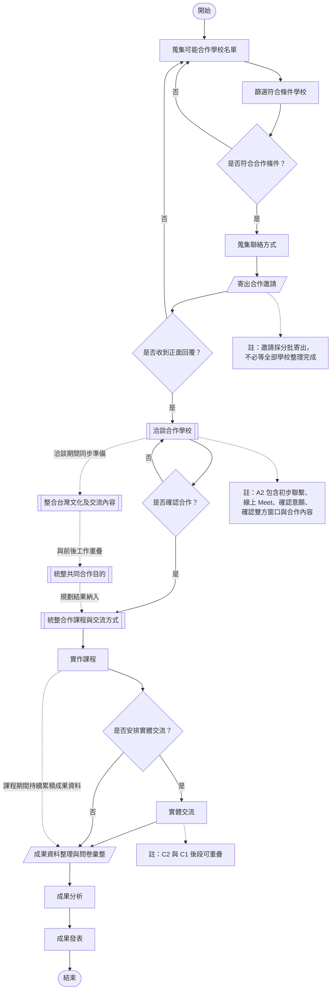

# 西班牙中學校文化交流計畫

本專案以「合作學校接洽 → 交流內容規劃 → 課程與交流執行 → 成果整理與發表」為主軸，並採並行排程方式進行。依目前甘特圖規劃，總期程約 **199 天（約 29 週）**。

> 正式開始日期尚未指定；部分工作可重疊執行，以縮短整體專案期程。

---

## 專案流程圖



---

## 流程圖符號說明

| 符號 | 用途 | 本專案範例 |
|---|---|---|
| 圓角終端 | 開始 / 結束 | 開始、結束 |
| 矩形 | 一般程序或作業 | 蒐集學校名單、實作課程、成果分析 |
| 菱形 | 決策與條件分支 | 是否符合條件、是否收到回覆、是否安排實體交流 |
| 平行四邊形 | 輸入 / 輸出 | 寄出合作邀請、成果資料與問卷彙整 |
| 雙線矩形 | 預定義流程 / 子流程 | 洽談合作學校、整合文化內容、統整合作目的 |
| 實線箭頭 | 正式流程順序 | 前一工作完成後進入下一工作 |
| 虛線箭頭 | 並行工作 / 註釋關聯 | A2 與 B1/B2 同步、C1 期間持續累積成果 |

> README 採 Mermaid 繪圖。部分 Visio / draw.io 專用符號（如跨頁連接器）在 README 中沒有必要，因此以 Mermaid 可穩定顯示的符號代替。

---

## 階段說明

### A｜合作學校接洽

| 編號 | 工作項目 | 規劃天數 | 說明 |
|---|---|---:|---|
| A1-1 | 蒐集可能合作學校名單 | 7 天 | 建立潛在合作學校清單 |
| A1-2 | 篩選符合條件學校 | 5 天 | 與名單蒐集重疊進行 |
| A1-3 | 蒐集聯絡方式 | 3 天 | 針對已篩選學校優先取得聯絡資訊 |
| A1-4 | 寄出邀請 | 5 天 | 採分批寄出，不必等待全部整理完成 |
| A2 | 洽談合作學校 | 40 天 | 初步聯繫 → 線上 Meet → 確認意願 → 確認雙方窗口與合作內容 |

### B｜交流內容與課程規劃

| 編號 | 工作項目 | 規劃天數 | 說明 |
|---|---|---:|---|
| B1 | 整合台灣文化及交流內容 | 7 天 | 台灣 / 西班牙文化特色、生活習慣、節慶文化、教育差異 |
| B2 | 統整共同合作目的 | 14 天 | 文化學習、國際觀點、語言交流、文化傳播、跨國合作經驗 |
| B3 | 統整合作課程與交流方式 | 20 天 | 線上交流、分組討論、文化分享、共同任務、成果發表、實體交流規劃 |

### C｜交流計畫執行

| 編號 | 工作項目 | 規劃天數 | 說明 |
|---|---|---:|---|
| C1 | 實作課程 | 120 天 | 教材、分組、主題課程、線上互動、共同任務、成果分享 |
| C2 | 實體交流 | 30 天 | 與 C1 後段重疊，包含校園參訪、文化體驗、面對面交流、合作活動與成果展示 |

### D｜成果整理與發表

| 編號 | 工作項目 | 規劃天數 | 說明 |
|---|---|---:|---|
| D1 | 成果資料整理 | 20 天 | 整理課程記錄、照片影片、學生作品、交流記錄及問卷 |
| D2 | 成果分析 | 10 天 | 學習成果、學生回饋、文化差異、交流成效、問題與改善 |
| D3 | 成果發表 | 1 天 | 最終成果發表里程碑 |

---

## 專案執行重點

- **並行排程**：A2 洽談期間可同步進行 B1、B2 等內容準備。
- **分批邀請**：符合條件的學校可先寄出邀請，不需等待全部名單完成。
- **邊執行邊紀錄**：C1 實作課程進行期間即持續累積成果資料，避免最後一次整理負擔過大。
- **實體交流可與課程後段重疊**：C2 不必等 C1 完全結束後才開始。
- **成果分析與整理後段可並行**：D2 可在 D1 後段資料已足夠時提前開始。

---

## 預估期程

- **總期程：約 199 天**
- **約 29 週**
- **正式開始日期：待定**

```text
A 合作學校接洽
        ↓
B 交流內容與課程規劃
        ↓
C 課程與實體交流執行
        ↓
D 成果整理、分析與發表
```
